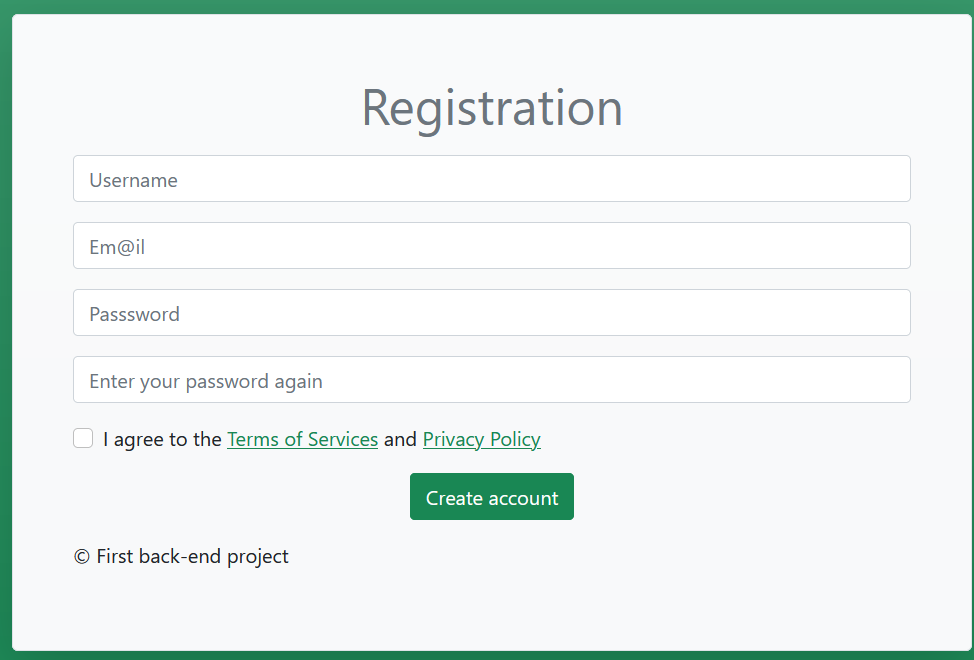

# Registration Form
This repository contains a **server-side** form using PHP to work on server-side validation.

<p align="center">
  
</p>


## Required
```
- PHP 5.4.0 or earlier
# OR
- WAMP/XAMP/MAMP server
```

## How to use it
1. Download `registrationForm` directory with all its  
documents on your system
2. Run your web server into the directory `public`

## How does it work
The form wait for user datas for registration.  
If user enter bad data format or forget to complete a field  
at the submission, the PHP return error messages.

## TODO
### Technique
  - Fix `checkIfPasswordsEqual` function in `process.php`
  - Prepare values before go in database
### UX
  - User-friendly Indications about validity of each fields

